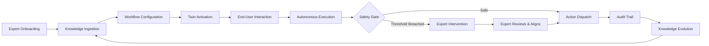
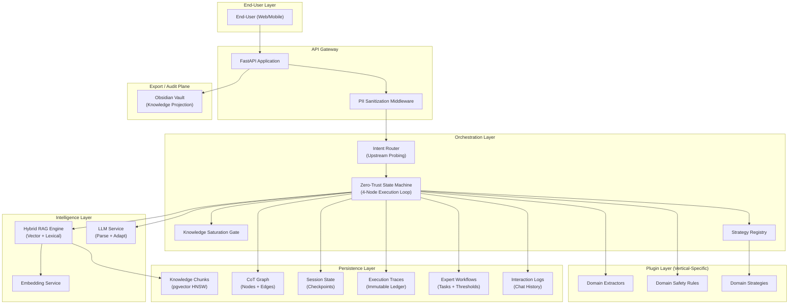
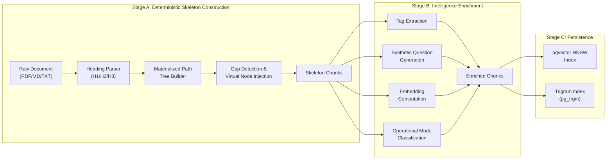
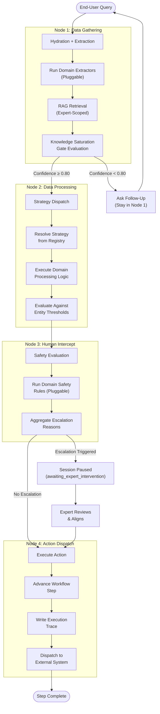
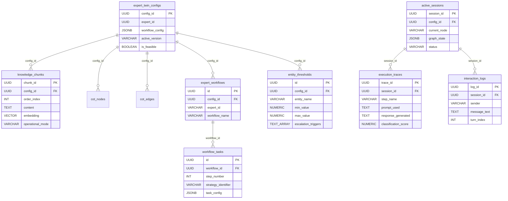
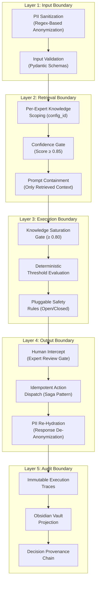
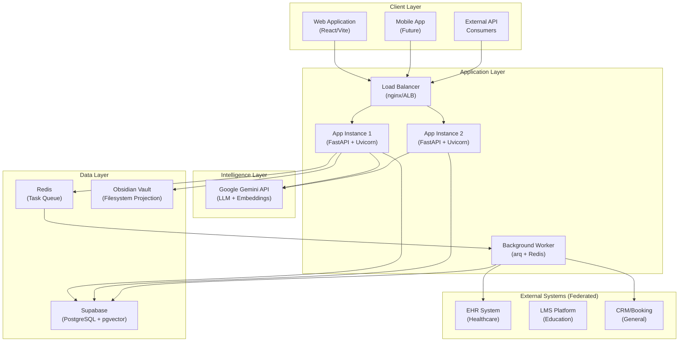

# Expert Twin Platform — Business Overview

**Document Classification**: Strategic — Executive & Engineering Leadership  
**Version**: 1.0.0  
**Date**: July 2026  
**Status**: Living Document  

---

## Table of Contents

1. [Executive Summary](#1-executive-summary)
2. [The Problem We Solve](#2-the-problem-we-solve)
3. [Solution Overview — The Expert Twin](#3-solution-overview--the-expert-twin)
4. [Platform Architecture](#4-platform-architecture)
5. [Core Engine Capabilities](#5-core-engine-capabilities)
6. [Zero-Trust Execution Model](#6-zero-trust-execution-model)
7. [Knowledge Representation & RAG Pipeline](#7-knowledge-representation--rag-pipeline)
8. [Vertical Extensibility Architecture](#8-vertical-extensibility-architecture)
9. [Data Architecture & Ownership Model](#9-data-architecture--ownership-model)
10. [Trust, Safety & Compliance Framework](#10-trust-safety--compliance-framework)
11. [Deployment Topology](#11-deployment-topology)
12. [Vertical Use Cases](#12-vertical-use-cases)
13. [Competitive Differentiation](#13-competitive-differentiation)
14. [Business Model & Value Proposition](#14-business-model--value-proposition)
15. [Roadmap & Strategic Outlook](#15-roadmap--strategic-outlook)
16. [Glossary](#16-glossary)

---

## 1. Executive Summary

The **Expert Twin Platform** is an enterprise-grade AI infrastructure that creates faithful digital replicas — "twins" — of human experts across any professional domain. Each twin captures an expert's knowledge, reasoning patterns, decision thresholds, and communication style, then autonomously executes structured workflows on behalf of that expert within strict safety boundaries.

Unlike general-purpose chatbots or copilots, an Expert Twin is:

- **Identity-scoped**: Each twin belongs to a specific expert (a doctor, a lawyer, a tutor) and operates exclusively within that expert's knowledge and authority boundary
- **Zero-Trust by design**: The AI never autonomously decides business-critical actions. All state-changing operations (escalations, bookings, approvals) are executed by deterministic programmatic logic — the LLM's role is strictly limited to natural language parsing and tone adaptation
- **Vertically extensible**: The core platform is domain-agnostic. Healthcare, legal, education, and finance are deployed as thin vertical plugins that register domain-specific extractors, safety rules, and processing strategies — not as separate codebases

The platform enables organizations to **scale expert availability** without scaling headcount, maintain **auditability** at every step, and deploy across verticals with a single underlying engine.

> [!IMPORTANT]
> **Core Thesis**: Every industry has a bottleneck of expert availability. A doctor can see 30 patients/day. A senior attorney can review 5 contracts. A professor can mentor 15 students. The Expert Twin doesn't replace these experts — it extends their reach by handling the structured, repeatable portions of their workflow while routing genuinely complex decisions back to the human expert.

---

## 2. The Problem We Solve

### 2.1 The Expert Availability Crisis

Across industries, the same structural constraint repeats:

| Industry | Expert Bottleneck | Impact |
|---|---|---|
| **Healthcare** | A specialist physician sees 20–30 patients/day; pre-consultation intake alone consumes 40% of appointment time | Patients wait weeks for appointments; clinicians burn out from repetitive data gathering |
| **Legal** | A senior partner reviews 4–6 contracts/day; junior associates lack the pattern-recognition to spot non-standard clauses | Clients pay $800/hr for work that is 70% structured review and 30% expert judgment |
| **Education** | A professor mentors 12–20 students per term; personalized feedback on assignments is impossible at scale | Students receive generic feedback; struggling learners aren't identified until it's too late |
| **Financial Advisory** | An advisor conducts 6–8 client reviews/day; regulatory compliance documentation consumes 50% of meeting prep | Advisors spend more time on paperwork than on actual advisory conversations |

### 2.2 Why Existing AI Solutions Fall Short

| Approach | Limitation |
|---|---|
| **Generic chatbots** (ChatGPT, Claude direct) | No expert-specific knowledge boundary; no audit trail; no safety enforcement; responses are "best guess" not "this expert's protocol" |
| **RAG-augmented chat** | Retrieves documents but doesn't execute structured workflows; no concept of task completion, escalation thresholds, or human intercept gates |
| **Custom fine-tuned models** | Expensive per expert ($50K+ per fine-tune); stale immediately; no runtime knowledge updates; no deterministic safety enforcement |
| **RPA / workflow automation** | Handles structured data well but cannot parse natural language input; brittle to variations in how end-users describe their situations |

### 2.3 The Gap

No existing product delivers all four requirements simultaneously:

1. **Expert-specific knowledge isolation** — each twin sees only its own expert's knowledge, never another's
2. **Structured workflow execution** — not just chat, but a deterministic state machine that gathers data, processes it, routes decisions to humans when thresholds are breached, and dispatches actions
3. **Zero-trust safety** — the LLM is never the decision-maker for business-critical actions; deterministic code is
4. **Vertical extensibility** — the same engine deploys across healthcare, legal, education, and finance without forking the codebase

The Expert Twin Platform fills this gap.

---

## 3. Solution Overview — The Expert Twin

### 3.1 What Is an Expert Twin?

An Expert Twin is a runtime AI entity that:

1. **Knows** what a specific expert knows — ingested from the expert's documents, protocols, and guidelines via a structural RAG pipeline
2. **Reasons** the way that expert reasons — following the expert's configured workflow steps, decision trees, and threshold rules
3. **Speaks** the way that expert speaks — adapting communication style, empathy level, and formality to the expert's persona configuration
4. **Escalates** when the expert would escalate — deterministic safety rules route complex or dangerous cases to the human expert for intervention, never silently proceeding

### 3.2 The Expert Twin Lifecycle



### 3.3 The Three Planes

The platform operates across three distinct planes:

| Plane | Purpose | Who Interacts |
|---|---|---|
| **Configuration Plane** | Expert onboarding, knowledge ingestion, workflow definition, threshold configuration, persona tuning | The expert (doctor, lawyer, tutor) |
| **Execution Plane** | Real-time interaction with end-users, state machine execution, RAG retrieval, safety evaluation, escalation | The end-user (patient, client, student) + the platform autonomously |
| **Audit Plane** | Immutable execution traces, decision provenance, knowledge version history, compliance reporting | Compliance officers, the expert (for review), system administrators |

---

## 4. Platform Architecture

### 4.1 High-Level Architecture Diagram



### 4.2 Layered Architecture Principles

| Layer | Responsibility | Key Design Principle |
|---|---|---|
| **API Gateway** | HTTP routing, CORS, PII sanitization, request/response lifecycle | Zero-trust PII boundary — all incoming data is anonymized before reaching business logic |
| **Orchestration** | Intent resolution, state machine transitions, data gathering, processing dispatch, human intercept evaluation, action dispatch | Deterministic execution — the LLM never decides which function to call |
| **Intelligence** | RAG retrieval, embedding generation, LLM-based parsing and tone adaptation | Strict prompt containment — the LLM only sees retrieved knowledge from the current expert's boundary |
| **Plugin** | Domain-specific data extraction, safety rule evaluation, processing strategies | Open/Closed — new extractors, rules, and strategies are added without modifying the core engine |
| **Persistence** | Knowledge storage, session checkpointing, execution audit, workflow configuration | Per-expert isolation — every query is scoped by `config_id`/`expert_id` at the access layer |
| **Audit** | Obsidian vault projection, compliance export, decision provenance | Immutable — execution traces cannot be modified after creation |

---

## 5. Core Engine Capabilities

### 5.1 Structural RAG Knowledge Ingestion

The platform doesn't just store documents — it **understands their structure**:



**Key differentiators of the ingestion pipeline**:

- **Materialized path preservation**: Every chunk knows its position in the document hierarchy (e.g., `obesity_guidelines.evaluation.bmi_assessment`). This enables **parent hydration** — when a leaf chunk matches a query, the system retrieves its full parent section for richer context
- **Synonym normalization**: "Introduction", "Background", "Scope" all normalize to `overview`, preventing duplicate sections from fragmenting the knowledge tree
- **Operational mode classification**: Each chunk is automatically classified as EXECUTION (action protocols), CLARIFICATION (FAQ/definitions), TROUBLESHOOTING (error handling), or LEARN (general knowledge) — enabling mode-aware retrieval at query time
- **Pluggable classification**: The classification keywords are not hardcoded into the base engine. Verticals register their own domain-specific keyword sets via a classification hook

### 5.2 Hybrid RAG Retrieval

Retrieval operates on two parallel search lanes fused into a single ranked result:

| Lane | Mechanism | Strength |
|---|---|---|
| **Vector Search** (Lane A) | pgvector HNSW cosine similarity on 768-dim Gemini embeddings | Captures semantic meaning ("What should I do about high fever?" matches "temperature management protocol") |
| **Lexical Search** (Lane B) | PostgreSQL pg_trgm trigram matching | Catches exact terminology that embedding models sometimes miss ("acetaminophen", "Rule 11(b)", "FERPA Section 99.31") |

**Score Fusion**: `combined_score = 0.7 × vector_score + 0.3 × lexical_score`

**Zero-Trust Gate**: Only chunks scoring above a configurable confidence threshold (default 0.85) pass through. Below-threshold chunks are logged as rejected for audit purposes but never injected into the LLM context.

**Parent Hydration**: After selecting top-K chunks, the system retrieves each chunk's parent section via materialized path lookup, deduplicates overlapping parents, and assembles a coherent context block — not a bag of disconnected fragments.

### 5.3 Session Management & Interaction State

The platform maintains full conversational state with explicit lifecycle semantics:

| State | Meaning | System Is Waiting For |
|---|---|---|
| `awaiting_user_input` | Gathering phase — the twin has asked a question | The end-user to respond |
| `processing` | Engine is computing (RAG retrieval, extraction, strategy execution) | Nothing — in-flight computation |
| `processing_synthesis` | Assembling a structured summary from gathered data | Background task completion |
| `awaiting_expert_intervention` | Safety threshold breached — escalated to human expert | The expert to review and approve |
| `awaiting_booking` | Expert has approved; awaiting downstream action dispatch | External system confirmation |
| `complete_booked` | Terminal — workflow completed with action dispatched | Nothing — done |
| `complete_closed` | Terminal — workflow completed without action needed | Nothing — done |

**Session resumption guarantee**: When a session resumes (after browser close, connection drop, or expert intervention), the full interaction history is reloaded from the `interaction_logs` table and re-injected into the LLM context — the end-user never resumes into a contextless fresh state.

### 5.4 Knowledge Unlearning (Vector Tombstoning)

Experts can retract previously ingested knowledge:

1. Expert selects specific CoT nodes for retraction
2. System marks nodes with `[RETRACTED]` prefix and injects the expert's rationale into metadata
3. Embeddings are tombstoned — the knowledge becomes invisible to RAG retrieval
4. The retraction is projected to the Obsidian audit plane with full provenance
5. The structural skeleton remains intact (edges, paths) — only the content is neutralized

This enables compliant knowledge correction without destroying the audit trail.

---

## 6. Zero-Trust Execution Model

### 6.1 The 4-Node State Machine

Every end-user interaction passes through a deterministic 4-node execution loop:



### 6.2 Why Zero-Trust?

The term "Zero-Trust" is borrowed from network security and applied to LLM execution:

> **We trust the LLM to parse language. We do not trust the LLM to make decisions.**

| The LLM Does | The LLM Does NOT Do |
|---|---|
| Parse natural language into validated JSON | Decide which function to call |
| Adapt communication style to the expert's persona | Evaluate whether a threshold has been breached |
| Generate empathetic follow-up questions | Determine whether to escalate to the human expert |
| Extract structured entities from free text | Execute booking, grading, filing, or any state-changing action |

All business logic (threshold evaluation, escalation routing, action dispatch) is executed by **deterministic Python code** consuming the LLM's structured output. The safety rules are programmatic — `temperature >= 103.0` is a Python comparison, not an instruction to the LLM to "follow."

### 6.3 Knowledge Saturation Gate

Before transitioning from Node 1 (Gathering) to Node 2 (Processing), the system evaluates data completeness:

```
Confidence = Completeness × Average Clarity

Where:
  Completeness = Variables Extracted / Variables Required
  Clarity = Per-variable quality score (1.0 = unambiguous, 0.5 = vague)
  
Transition threshold: Confidence ≥ 0.80
```

If the confidence score falls below threshold, the system **stays in Node 1** and generates a targeted follow-up question for the missing variables — it does not proceed with incomplete data.

### 6.4 Immutable Configuration Snapshots

When a session begins, the system freezes the expert's current workflow configuration, task definitions, and threshold rules into an **immutable JSON snapshot** stored in the session record. Even if the expert updates their configuration mid-session, active sessions continue executing against the snapshot they started with. This prevents mid-session behavioral changes that could cause inconsistent escalation decisions.

---

## 7. Knowledge Representation & RAG Pipeline

### 7.1 The Knowledge Graph

Each expert's knowledge is stored as a dual representation:

| Representation | Purpose | Storage |
|---|---|---|
| **Knowledge Chunks** (Materialized Path Tree) | Structural document fragments with hierarchical paths, embeddings, tags, and synthetic questions | `knowledge_chunks` table with pgvector HNSW index |
| **Chain-of-Thought Graph** (CoT Nodes + Edges) | Expert's reasoning graph — nodes represent decision points, edges represent relationships (requires, contradicts, related_to) | `cot_nodes` + `cot_edges` tables |

The dual representation enables two retrieval modes:
1. **Content retrieval** (via RAG): "What does this expert know about X?"
2. **Reasoning retrieval** (via graph traversal): "How does this expert reason about X? What depends on X? What contradicts X?"

### 7.2 Context Synthesis (Long-Session Optimization)

For sessions exceeding 4 interaction turns, the system activates **context synthesis** — an intermediate LLM pass that:

1. Extracts hard facts from the accumulated chat history into a structured profile
2. Compresses the full history into `[Synthesized Profile] + [Last 3 Raw Turns]`
3. Uses the compressed payload as the LLM's context window

This prevents context window exhaustion in long-running sessions while preserving factual accuracy.

### 7.3 Multi-Dimensional Search

Retrieval is not one-dimensional. The system supports:

- **Operational mode filtering**: A query flagged as "troubleshooting" only searches TROUBLESHOOTING-classified chunks
- **Per-expert scoping**: Every search is filtered by `config_id` — Expert A's knowledge never bleeds into Expert B's results
- **Score fusion**: Vector and lexical scores are weighted and combined, ensuring both semantic and terminological precision

---

## 8. Vertical Extensibility Architecture

### 8.1 The Plugin Model

The core platform exposes four extension points. Verticals implement these — they never modify the base engine:

```mermaid
graph TB
    subgraph "Base Platform (Vertical-Agnostic)"
        ABC1["DataExtractor ABC"]
        ABC2["SafetyRule ABC"]
        ABC3["ProcessingStrategy ABC"]
        ABC4["StrategyRegistry"]
        ABC5["IntentRouter"]
        ABC6["ClassificationHook"]
    end

    subgraph "Healthcare Vertical"
        H1["VitalsExtractor"] -->|implements| ABC1
        H2["SymptomExtractor"] -->|implements| ABC1
        H3["FeverSafetyRule"] -->|implements| ABC2
        H4["CardiacSafetyRule"] -->|implements| ABC2
        H5["SymptomProcessor"] -->|implements| ABC3
        H6["DietaryPlanner"] -->|implements| ABC3
        H5 -->|registers into| ABC4
        H6 -->|registers into| ABC4
    end

    subgraph "Legal Vertical (Future)"
        L1["ClauseExtractor"] -->|implements| ABC1
        L2["PrecedentRiskRule"] -->|implements| ABC2
        L3["ContractAnalyzer"] -->|implements| ABC3
        L3 -->|registers into| ABC4
    end

    subgraph "Education Vertical (Future)"
        E1["LearningStyleExtractor"] -->|implements| ABC1
        E2["PlagiarismRule"] -->|implements| ABC2
        E3["AssessmentGrader"] -->|implements| ABC3
        E3 -->|registers into| ABC4
    end
```



### 8.2 Extension Point Contracts

| Extension Point | ABC / Interface | Contract |
|---|---|---|
| **DataExtractor** | `extract(text: str) → Dict[str, Any]` | Parse raw text and extract structured key-value pairs (e.g., vitals, clause types, grade levels). Each extractor handles one category of data. |
| **SafetyRule** | `evaluate(data, score, thresholds) → (bool, str)` | Evaluate whether an anomaly/escalation condition is triggered. Returns `(is_anomaly, reason)`. Each rule checks one specific safety concern independently. |
| **ProcessingStrategy** | `process(data, thresholds, context) → (Dict, List[str])` | Process extracted data against threshold rules. Returns `(processed_data, escalation_reasons)`. Dispatched dynamically by the StrategyRegistry. |
| **ClassificationHook** | `classify(title, content) → str` | Classify a knowledge chunk into an operational mode (EXECUTION, CLARIFICATION, TROUBLESHOOTING, LEARN). Verticals register domain-specific keyword sets. |

### 8.3 App Factory Pattern

The base engine exposes a `create_app()` factory. Verticals compose their application by:

1. Calling `create_app()` to get a fully configured base FastAPI application
2. Registering their domain-specific plugins via `plugin_registry.py`
3. Mounting their vertical-specific API routes
4. Providing their vertical-specific DI wiring

```python
# verticals/healthcare/backend/app/main.py
from base.backend.app.main import create_app
from verticals.healthcare.backend.app.plugin_registry import register_plugins
from verticals.healthcare.backend.app.api.routes import preconsult_router

app = create_app(title="Expert Twin — Healthcare")
register_plugins()  # Registers extractors, safety rules, strategies
app.include_router(preconsult_router, prefix="/api")
```

This means a legal vertical, education vertical, or financial advisory vertical can be deployed by writing a similarly thin `main.py` — not by forking the entire codebase.

---

## 9. Data Architecture & Ownership Model

### 9.1 Data Ownership Doctrine

The Expert Twin Platform follows a strict **data federation** model:

| Data Category | Owned By Twin? | Storage Location | Rationale |
|---|---|---|---|
| Expert configuration (workflows, thresholds, persona) | ✅ Yes | `expert_twin_configs`, `expert_workflows`, `entity_thresholds` | This IS the twin's core identity |
| Knowledge chunks + embeddings | ✅ Yes | `knowledge_chunks`, `cot_nodes/edges` | The twin's knowledge graph |
| Session/interaction state | ✅ Yes | `active_sessions`, `interaction_logs` | Chat history and execution state |
| Execution traces / audit logs | ✅ Yes | `execution_traces` | Immutable compliance ledger |
| Domain transactional data (patient records, case files, student records) | ❌ No | External system of record (EHR, LMS, CRM) | Fetched on-demand via federation adapters |
| Booking/scheduling data | ❌ No | External booking system | Dispatched via saga orchestrator to external APIs |

### 9.2 Entity-Relationship Diagram



### 9.3 Per-Expert Data Isolation

Every data access is scoped by `config_id` (the expert's unique identity) at the **query layer** — not just by naming convention:

- Knowledge chunk retrieval (vector search + lexical search) filters by `config_id`
- Session state is linked to `config_id` via the `active_sessions` table
- Workflow tasks and thresholds are accessed through `expert_workflows.config_id`
- CoT graph queries are scoped by `config_id`

This ensures **centralized routing but isolated data**: all experts share the same deployment infrastructure, but Expert A can never access Expert B's knowledge or session data.

---

## 10. Trust, Safety & Compliance Framework

### 10.1 Defense-in-Depth Safety Architecture



### 10.2 PII Sanitization

All incoming JSON payloads are processed by the PII Sanitization Middleware before reaching any business logic:

1. **Inbound**: Email addresses, phone numbers, and SSNs are detected via compiled regex patterns, replaced with deterministic hash tokens (e.g., `[EMAIL-A4F2B1C3]`), and the mapping is stored per-request
2. **Processing**: All downstream services — LLM, RAG, extractors — see only anonymized data
3. **Outbound**: Response payloads are de-anonymized before returning to the end-user

This means the LLM **never sees real PII** — even in logs and execution traces.

### 10.3 Saga Pattern for External Actions

All actions that involve external systems (booking appointments, filing documents, submitting grades) follow the **Saga pattern** with compensating transactions:

1. **Local intent lock**: Session status updated to `processing_booking` before the external call
2. **External execution**: HTTP call to downstream API with idempotency key (SHA-256 hash of session + parameters)
3. **Retry with exponential backoff**: Transient failures are retried up to 3 times
4. **Compensating rollback**: Permanent failures trigger a rollback to `awaiting_expert_intervention` state
5. **Reconciliation cron**: A background sweeper detects sessions stuck in `processing_booking` and queries the downstream system to determine if the action actually completed before the crash

### 10.4 Compliance Readiness

| Requirement | How the Platform Addresses It |
|---|---|
| **Audit trail** | Every LLM call, RAG retrieval, safety evaluation, and state transition is logged in `execution_traces` with full input/output capture |
| **Data minimization** | PII is anonymized in-flight; the LLM never processes real identifiers |
| **Right to be forgotten** | Knowledge unlearning (vector tombstoning) neutralizes specific content while preserving structural audit trail |
| **Expert accountability** | All actions trace back to the expert's configuration snapshot — "why did the twin escalate?" is always answerable |
| **Immutable snapshots** | Active sessions freeze the expert's config at session start — mid-session config changes don't affect running sessions |

---

## 11. Deployment Topology

### 11.1 Production Architecture



### 11.2 Scaling Characteristics

| Component | Scaling Strategy |
|---|---|
| **API instances** | Horizontal — stateless; session state lives in PostgreSQL |
| **Background workers** | Horizontal — arq workers are independent; Redis distributes tasks |
| **Database** | Vertical (Supabase managed) + read replicas for high-read RAG workloads |
| **LLM calls** | Rate-limited by Gemini API quotas; queue-based backpressure via Redis |
| **Knowledge storage** | HNSW index scales sub-linearly; partition by `config_id` if needed |

### 11.3 Mock Mode (Development)

All repository implementations support a **mock mode** — when Supabase credentials are absent, the system falls back to in-memory dictionaries. This enables:

- Local development without any external dependencies
- Unit testing without database connections
- Demo/showcase deployments with zero infrastructure

---

## 12. Vertical Use Cases

### 12.1 Healthcare — Digital Twin of a Physician

| Aspect | Implementation |
|---|---|
| **Expert** | A physician (e.g., Dr. Sterling, Cardiologist) |
| **End-User** | A patient seeking pre-consultation intake |
| **Workflow** | Structured pre-consultation: gather symptoms → evaluate vitals → synthesize clinical profile → escalate if thresholds breached → book appointment |
| **Extractors** | VitalsExtractor (temperature, blood pressure), SymptomExtractor (chest pain, shortness of breath) |
| **Safety Rules** | FeverSafetyRule (≥103°F), CardiacSafetyRule (chest pain), ThresholdSafetyRule (dynamic per-expert thresholds) |
| **Strategies** | SymptomProcessor, DietaryPlanner, LabReportProcessor, VitalsValidator |
| **Federation** | Patient records from EHR system; appointment booking via clinic API |

### 12.2 Legal — Digital Twin of a Senior Attorney

| Aspect | Implementation |
|---|---|
| **Expert** | A senior partner specializing in contract law |
| **End-User** | A junior associate or client uploading contracts for review |
| **Workflow** | Contract review: extract clause types → evaluate against standard playbook → flag non-standard terms → escalate high-risk clauses → generate markup suggestions |
| **Extractors** | ClauseExtractor (indemnification, termination, IP assignment), PartyExtractor (named entities, jurisdictions) |
| **Safety Rules** | UnusualClauseRule (non-standard indemnification), JurisdictionConflictRule, ValueThresholdRule (contract value > $1M) |
| **Strategies** | ClauseAnalyzer, RiskAssessor, ComplianceChecker |
| **Federation** | Case management system; court filing APIs; precedent databases |

### 12.3 Education — Digital Twin of a Professor

| Aspect | Implementation |
|---|---|
| **Expert** | A professor of Computer Science |
| **End-User** | A student seeking tutoring or assignment feedback |
| **Workflow** | Tutoring session: assess current understanding → identify gaps → provide targeted explanations → assign practice problems → evaluate submissions → escalate struggling students |
| **Extractors** | ConceptExtractor (data structures, algorithms, complexity), LearningStyleExtractor (visual, textual, hands-on) |
| **Safety Rules** | PlagiarismIndicatorRule, ProgressStallRule (student stuck for >3 sessions on same concept), EmotionalDistressRule |
| **Strategies** | ConceptExplainer, AssessmentGrader, PracticeGenerator |
| **Federation** | LMS grade book; student information system; plagiarism detection API |

### 12.4 Financial Advisory — Digital Twin of a Wealth Advisor

| Aspect | Implementation |
|---|---|
| **Expert** | A certified financial planner |
| **End-User** | A client seeking portfolio review or retirement planning |
| **Workflow** | Client review: gather financial profile → assess risk tolerance → evaluate portfolio allocation → flag compliance concerns → generate recommendations → escalate significant rebalancing |
| **Extractors** | FinancialProfileExtractor (income, assets, liabilities), RiskToleranceExtractor (questionnaire scoring) |
| **Safety Rules** | SuitabilityRule (recommendations match risk profile), ConcentrationRiskRule (>30% in single asset), RegulatoryComplianceRule |
| **Strategies** | PortfolioAnalyzer, TaxOptimizer, RetirementProjector |
| **Federation** | Brokerage APIs; market data feeds; regulatory filing systems |

---

## 13. Competitive Differentiation

### 13.1 Positioning Matrix

| Capability | Expert Twin Platform | Generic AI Chat | Custom Fine-Tuned Model | Traditional RPA |
|---|---|---|---|---|
| Expert-specific knowledge boundary | ✅ Per-expert isolated | ❌ Shared model | ⚠️ Per-model but static | ❌ No NLP |
| Structured workflow execution | ✅ 4-node state machine | ❌ Freeform chat | ❌ No workflow concept | ✅ Rigid workflows |
| Natural language understanding | ✅ LLM-powered extraction | ✅ Native capability | ✅ Native capability | ❌ Pattern matching only |
| Deterministic safety enforcement | ✅ Programmatic rules | ❌ LLM-instructed | ❌ LLM-instructed | ✅ Rule-based |
| Human-in-the-loop escalation | ✅ Architectural guarantee | ❌ Optional/manual | ❌ Not built in | ⚠️ Manual exception queues |
| Runtime knowledge updates | ✅ Ingest new docs anytime | ❌ Requires retraining | ❌ Requires re-fine-tuning | ❌ Requires re-programming |
| Multi-vertical from single engine | ✅ Plugin architecture | ❌ Generic only | ❌ One model per domain | ❌ One workflow per use case |
| Full audit trail | ✅ Immutable traces | ❌ No structured audit | ❌ Limited logging | ⚠️ Basic logging |
| PII protection | ✅ In-flight anonymization | ❌ Data sent to provider | ❌ In training data | ✅ No NLP = no PII risk |

### 13.2 Moats

1. **Architecture moat**: The Zero-Trust execution model is a fundamentally different paradigm from "prompt engineering + guardrails." It's not a layer on top of an LLM — it's a deterministic state machine that uses the LLM as a component
2. **Data moat**: Each deployed twin accumulates expert-specific knowledge, execution traces, and interaction patterns that make the twin more valuable over time
3. **Network moat**: As more verticals are deployed on the same engine, the base platform's testing surface, reliability, and feature breadth improve for all verticals simultaneously
4. **Compliance moat**: The immutable audit trail, PII sanitization, and vector tombstoning capabilities are architecturally embedded — they can't be added as afterthoughts to competitor products

---

## 14. Business Model & Value Proposition

### 14.1 Value Creation

| Stakeholder | Value Delivered |
|---|---|
| **The Expert** | Extends capacity by 3-5x without additional hires; handles routine intake/assessment; ensures no case falls through the cracks |
| **The End-User** | Immediate access to expert-quality structured interaction; no multi-week wait times; consistent quality regardless of the expert's availability |
| **The Organization** | Scalable expert delivery; audit-ready compliance; reduced operational cost per interaction; multi-vertical deployment from single infrastructure investment |

### 14.2 Revenue Models

| Model | Description | Fit |
|---|---|---|
| **Platform License** | Annual license fee for base platform + one vertical | Enterprise customers with in-house deployment teams |
| **Per-Twin Subscription** | Monthly fee per active Expert Twin | SMBs (individual practices, small law firms) |
| **Interaction-Based** | Per-session or per-interaction pricing | High-volume, low-margin verticals (education, customer service) |
| **Vertical Marketplace** | Revenue share with third-party vertical developers who build on the plugin architecture | Platform ecosystem play (long-term) |

### 14.3 Unit Economics Drivers

| Cost Driver | Optimization |
|---|---|
| **LLM API costs** | Context synthesis reduces token consumption by 40-60% for long sessions; confidence gating prevents unnecessary LLM calls when data is insufficient |
| **Storage costs** | Materialized path deduplication reduces vector storage by 25-30% vs. naive chunking |
| **Expert time** | Safety rules only escalate genuinely complex cases; experts review summaries, not raw transcripts |

---

## 15. Roadmap & Strategic Outlook

### Phase 1 — Foundation (Current)
- ✅ Core engine with 4-node state machine
- ✅ Structural RAG ingestion pipeline
- ✅ Hybrid retrieval (vector + lexical)
- ✅ Healthcare vertical (pre-consultation workflow)
- ✅ Obsidian vault audit projection
- ✅ PII sanitization middleware

### Phase 2 — Platform Maturity (Next)
- 🔲 Base/vertical separation (architecture-correctness restructure)
- 🔲 Intent router (upstream probing before twin identification)
- 🔲 Explicit session state enum with full resumption guarantee
- 🔲 Per-expert data isolation enforcement at query layer
- 🔲 Federation adapter pattern for external system integration

### Phase 3 — Multi-Vertical Expansion
- 🔲 Legal vertical (contract review workflow)
- 🔲 Education vertical (tutoring + assessment workflow)
- 🔲 Vertical marketplace SDK for third-party developers
- 🔲 Multi-expert routing (one organization, multiple expert twins, single entry point)

### Phase 4 — Enterprise Scale
- 🔲 Multi-tenant deployment with organization-level isolation
- 🔲 Advanced analytics dashboard (per-expert utilization, escalation patterns, knowledge gaps)
- 🔲 Real-time collaboration (expert + twin co-piloting during live sessions)
- 🔲 Voice interface integration (telephony gateway for call-center use cases)

---

## 16. Glossary

| Term | Definition |
|---|---|
| **Expert Twin** | An AI entity that replicates a specific human expert's knowledge, reasoning, and communication style within defined safety boundaries |
| **Config ID** | The unique identifier for an expert's twin configuration — the root key for all per-expert data isolation |
| **Expert ID** | The unique identifier for the human expert who owns the twin |
| **End-User** | The person interacting with the expert's twin (e.g., a patient, client, student) |
| **Knowledge Chunk** | A structural fragment of an expert's ingested knowledge, with materialized path, embedding, and metadata |
| **Materialized Path** | A dot-notation string representing a chunk's position in the document hierarchy (e.g., `guidelines.evaluation.assessment`) |
| **Operational Mode** | The classification of a knowledge chunk: EXECUTION, CLARIFICATION, TROUBLESHOOTING, or LEARN |
| **CoT Graph** | Chain-of-Thought graph — the expert's reasoning structure represented as nodes (decision points) and edges (relationships) |
| **Saturation Gate** | The confidence evaluation that determines whether enough data has been gathered before proceeding to processing |
| **Strategy** | A pluggable processing algorithm registered by a vertical to handle specific task types |
| **Safety Rule** | A pluggable anomaly detection rule registered by a vertical to evaluate escalation conditions |
| **Vector Tombstoning** | The process of neutralizing a knowledge chunk's embedding to make it invisible to RAG retrieval while preserving the audit trail |
| **Immutable Snapshot** | A frozen copy of the expert's workflow configuration captured at session start, immune to mid-session updates |
| **Saga Pattern** | A distributed transaction pattern for external actions: local lock → external call → confirm or compensating rollback |
| **Federation Adapter** | An interface for fetching domain data from external systems of record on demand, rather than owning the data |

---

*This document is maintained as a living reference. For technical implementation details, refer to the Engineering Specification. For deployment procedures, refer to the Operations Runbook.*
