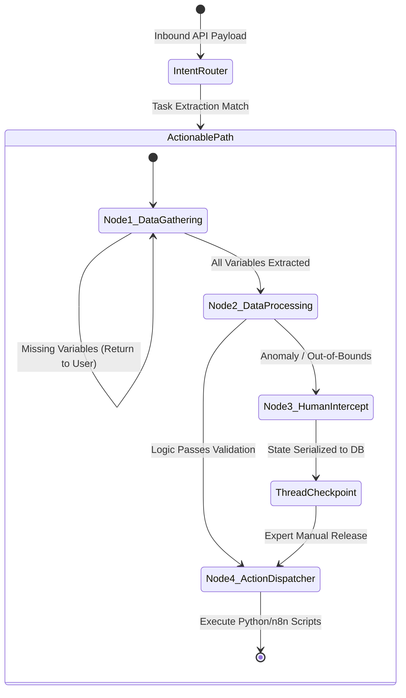

# Digital Twin Framework: Low-Level Architecture (LLA)

## 1. Introduction to the Execution Mechanics

While the High-Level Architecture defines *where* processes live, the Low-Level Architecture (LLA) defines exactly *how* deterministic execution is achieved. The Digital Twin is engineered to eliminate the probabilistic hallucinations common in LLM wrappers. It achieves this through strict Bimodal Intent Routing and a highly structured, 4-Node state machine managed by LangGraph.

This document details the exact execution paths, data schemas, thread-locking mechanisms, and routing logic that power the core Python backend.

---

## 2. Bimodal Intent Routing

When an inbound payload reaches the FastAPI gateway, it must be categorized instantly. Handing all requests to a heavy execution thread is inefficient and dangerous. The system uses Bimodal Intent Routing to split traffic into two distinct deterministic paths.

### 2.1 The Ingress Pipeline
1.  **Sanitization:** The raw payload passes through a `PIISanitizationMiddleware` to redact sensitive identifiers before any ML processing occurs.
2.  **Vectorization:** The sanitized query is passed through a lightweight `SentenceTransformers` embedding model to generate a 1536-dimensional vector.
3.  **Intent Classification:** A classification function evaluates the vector against predefined intent centroids (Informational vs. Actionable).

### 2.2 The Smooth Read Path
If the intent is purely informational (e.g., "What are the contraindications for Drug X according to Dr. Smith's protocols?"), the system triggers the Smooth Read Path.
*   **Execution:** It performs a direct `pgvector` HNSW index search on the Supabase SSOT.
*   **Threshold:** If the Cosine Similarity metric is > `0.85`, the retrieved context is deemed authoritative.
*   **Response Generation:** A lightweight formatting LLM (acting purely as a synthesizer, strictly prompted to use *only* the provided context) generates the response using the expert's communication matrix. The LangGraph thread is entirely bypassed.

### 2.3 The Active Action Path
If the intent requires data collection, multi-step logic, or external tool invocation (e.g., "I need to request a protocol override for Patient Y"), the system triggers the LangGraph 4-Node Execution Thread.

### 2.4 Routing Pseudocode (FastAPI Implementation)

```python
@app.post("/api/v1/interact")
async def intent_router(request: Request):
    payload = await request.json()
    sanitized_query = sanitize_pii(payload.get("query"))
    query_vector = embedder.encode(sanitized_query)
    
    # Classify the intent based on vector semantics
    intent = classify_intent(query_vector)

    if intent == "INFORMATIONAL":
        # Bypass execution graph, go straight to DB
        context = query_supabase_vector_match(query_vector, threshold=0.85)
        if context:
            formatted_response = format_vetted_response(context, expert_tone_id)
            return {"route": "smooth", "data": formatted_response}
        else:
            return {"route": "rejection", "data": "Query is outside my epistemic boundaries."}

    elif intent == "ACTIONABLE":
        # Initialize LangGraph state object
        initial_state = {
            "session_id": payload.get("session_id"),
            "user_input": sanitized_query, 
            "extracted_variables": {},
            "execution_status": "GATHERING"
        }
        # Invoke the state machine thread
        result = digital_twin_graph.invoke(initial_state)
        return {"route": "graph_execution", "data": result}
```

---

## 3. The 4-Node LangGraph Execution Thread

When on the Active Action Path, the system relies on a strictly typed state object that accumulates data as it traverses the graph.

### 3.1 State Schema Definition

```python
class AgentState(TypedDict):
    session_id: str                 # Unique UUID for thread tracking
    user_input: str                 # Raw/Sanitized prompt
    extracted_variables: dict       # KV pairs (e.g., {"symptom": "fever", "duration": 3})
    clinical_baseline: list         # Validated context pulled from SSOT
    anomaly_flag: bool              # Boolean tripwire for edge cases
    execution_status: str           # Enum: GATHERING, PROCESSING, BLOCKED, COMPLETED
```

### 3.2 Node 1: Data Gathering (The Adaptive Loop)
*   **Function:** This node assesses the user's request against the required variables for the matched task.
*   **Mechanic:** If variables are missing, it halts progression and replies to the user with targeted questions. It loops on itself (`Node 1 -> Node 1`) across multi-turn dialogue until the `extracted_variables` dictionary is completely populated according to the expert's schema.

### 3.3 Node 2: Data Processing & Evaluation
*   **Function:** Once all data is gathered, this node performs cross-referencing.
*   **Mechanic:** It takes the `extracted_variables` and compares them to the `clinical_baseline` (the expert's rules fetched from Supabase). 
*   **Branching Logic:** If the variables fall within expected parameters, execution proceeds to Node 4. If the data represents a contradiction, edge case, or severe anomaly, it sets `anomaly_flag = True` and diverts execution to Node 3.

### 3.4 Node 3: Human Intercept (HITL)
*   **Function:** The definitive enterprise circuit breaker. 
*   **Mechanic:** Triggered by the anomaly flag. The node leverages LangGraph's checkpointing saver to serialize the exact memory state (the `AgentState` object) to a Postgres/SQLite checkpoint database. The thread is instantly frozen. An alert is sent to the expert's Control Plane UI. The system ceases interaction on this thread until the expert manually resolves the anomaly and releases the checkpoint lock.

### 3.5 Node 4: Action / Skills Dispatcher
*   **Function:** The deterministic executor.
*   **Mechanic:** This node does **not** use LLMs. It is a pure Python function caller. It takes the validated `AgentState` and packages it into JSON payloads to trigger external integrations, primarily via n8n webhooks. It commits final records to the database and sets `execution_status = "COMPLETED"`.

---

## 4. Execution State Machine Diagram



---

## 5. Concurrency & Thread Isolation

In high-volume enterprise environments, multiple concurrent messages on the same workflow thread can cause race conditions or corrupt the `extracted_variables` dictionary.

### 5.1 Active Execution Locks
To ensure atomicity, the system implements Active Execution Locks. When a thread enters **Node 2 (Data Processing)**, an optimistic lock is placed on the `session_id`. If the user sends another message while Node 2 is processing, the gateway queues the message or rejects it with a "Processing, please wait" status, preventing state corruption.

### 5.2 Thread Checkpointing & Hydration
When a thread is frozen at **Node 3**, it is purged from active server memory to conserve RAM. The serialized byte-string of the LangGraph state is stored in Postgres. When the expert accesses the Control Plane to review the incident, the API dynamically hydrates the exact state of that thread, allowing the expert to see the exact input, the extracted variables, and the specific rule that caused the anomaly tripwire. 

Once resolved, the thread is rehydrated into LangGraph memory, and execution resumes deterministically from Node 4.
