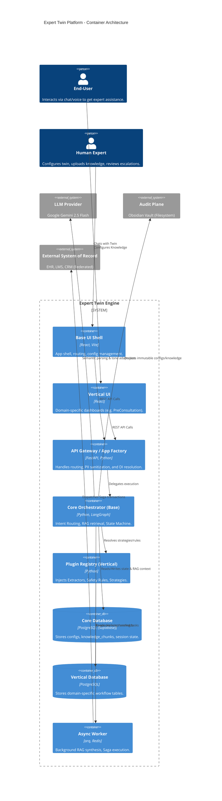
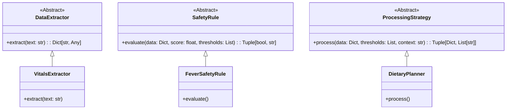
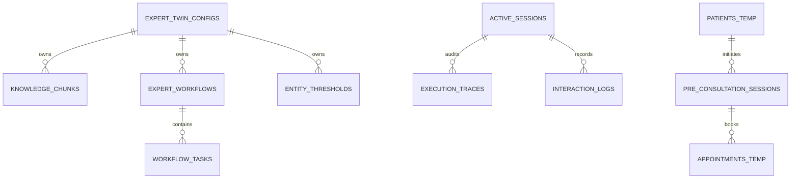

# Expert Twin Platform — Technical Architecture Document

**Document Classification**: Technical — Engineering Leadership & Core Platform Team  
**Version**: 1.0.0  
**Date**: July 2026  
**Status**: Living Document  
**Author**: Chief System Architect  

---

## Table of Contents

1. [Architectural Philosophy](#1-architectural-philosophy)
2. [High-Level System Context (C4 Model)](#2-high-level-system-context-c4-model)
3. [The Core Platform Engine (Base)](#3-the-core-platform-engine-base)
4. [Vertical Plugin Extensibility](#4-vertical-plugin-extensibility)
5. [Zero-Trust Execution Orchestration](#5-zero-trust-execution-orchestration)
6. [Knowledge Ingestion & RAG Subsystem](#6-knowledge-ingestion--rag-subsystem)
7. [Data Architecture & Federation](#7-data-architecture--federation)
8. [Session State & Context Management](#8-session-state--context-management)
9. [Infrastructure & Deployment Topology](#9-infrastructure--deployment-topology)

---

## 1. Architectural Philosophy

The Expert Twin Platform is engineered under the premise that **Domain Knowledge (Base)** and **Domain Application (Vertical)** must remain strictly decoupled. The platform is not a generalized LLM wrapper; it is a deterministic workflow orchestration engine that leverages LLMs purely for semantic translation (Natural Language $\leftrightarrow$ JSON) while relying on compiled, testable code for business logic and safety guardrails.

### Core Architectural Doctrines:
1. **Zero-Trust LLM Boundary**: The LLM parses text and adapts tone. It never evaluates thresholds, triggers escalations, or invokes external tools autonomously.
2. **Open/Closed Principle via Plugins**: The core orchestrator (`base/`) is closed for modification but open for extension. Verticals (Healthcare, Legal, etc.) inject behavior via tightly defined interface contracts.
3. **Federated Data Ownership**: The platform owns the expert's brain (configurations, knowledge embeddings, session state). It does *not* own the end-user's transactional reality (EHRs, CRMs, booking systems).
4. **Per-Expert Data Isolation**: Every data retrieval path forces a `config_id` partition key. Centralized infrastructure, heavily isolated tenants.

---

## 2. High-Level System Context (C4 Model)

The following diagram illustrates the Level-2 container architecture of the Expert Twin Platform.



---

## 3. The Core Platform Engine (`base/`)

The core engine is structured using Domain-Driven Design (DDD) principles. It is unaware of any specific vertical (no "doctor", "patient", or "clinical" references). 

### 3.1 Component Stack
- **API/Routes (`base/backend/app/api`)**: Generic endpoints for Session Initialization, Chat turn progression, Config management, and Document Ingestion.
- **Dependency Injection Container**: Uses an IoC (Inversion of Control) provider `BaseServiceProvider`. Verticals extend this provider to inject their specific repository implementations and plugins.
- **Intent Router**: Sits at the absolute front of the orchestration lifecycle. Uses zero-shot classification (via LLM) guided by vertical-registered `IntentConfig` to determine which Workflow to dispatch.
- **RAG Subsystem**: Handles document ingestion, hierarchical chunking, and dual-lane retrieval (Lexical + Vector).

### 3.2 The App Factory Pattern
The entry point `base/backend/app/main.py` does not run the application directly. It exports a `create_app()` factory. The vertical's entry point invokes this factory, injecting its custom routers and plugins.

```python
def create_app(
    title: str = "Expert Twin Engine",
    extra_routers: list = None,
    startup_hook: callable = None,
) -> FastAPI:
    # Assembles base middleware, base routers, and vertical routers
    ...
```

---

## 4. Vertical Plugin Extensibility

Verticals (e.g., `verticals/healthcare/`) bind to the Base engine through strict Abstract Base Classes (ABCs). This prevents domain logic from leaking into the core state machine.

### 4.1 Interface Contracts



### 4.2 Registration Lifecycle
During `startup_hook`, the vertical invokes the Base Registry:
```python
# verticals/healthcare/backend/app/plugin_registry.py
base_provider.register_extractors([VitalsExtractor(), SymptomExtractor()])
base_provider.register_safety_rules([FeverSafetyRule(), ThresholdSafetyRule()])
StrategyRegistry.register("DIETARY_PLANNER", DietaryPlanner())
```

---

## 5. Zero-Trust Execution Orchestration

The heart of the Expert Twin is a LangGraph-powered state machine. It is designed to trap hallucinations by isolating the LLM into a specific "Semantic Parsing" box, strictly gated by deterministic code.

### 5.1 Single-Turn Execution Flow (Sequence Diagram)

```mermaid
sequenceDiagram
    participant U as End-User
    participant API as API Gateway (PII Sanitizer)
    participant IR as Intent Router
    participant SM as Zero-Trust State Machine
    participant PL as Vertical Plugins (Extractors/Rules)
    participant RAG as Knowledge Repo
    participant LLM as Gemini LLM

    U->>API: "I have a fever of 103"
    API->>API: Sanitize PII
    API->>IR: Route Intent
    IR->>SM: Dispatch Workflow (Config Snapshot)
    
    rect rgb(30, 40, 60)
        Note over SM,LLM: NODE 1: GATHERING
        SM->>PL: run extractors()
        PL-->>SM: {"temperature": 103.0}
        SM->>RAG: retrieve_context(query, config_id)
        RAG-->>SM: [Fever management protocols]
        SM->>SM: Evaluate Knowledge Saturation Gate
    end

    rect rgb(40, 30, 60)
        Note over SM,PL: NODE 2: PROCESSING (If Saturated)
        SM->>PL: Execute Strategy
        PL-->>SM: Processed Profile
    end

    rect rgb(60, 30, 40)
        Note over SM,PL: NODE 3: HUMAN INTERCEPT (Safety Gate)
        SM->>PL: evaluate_safety_rules()
        Note right of PL: FeverRule: 103 >= 103 -> ESCALATE!
        PL-->>SM: (True, "Critical temperature")
    end
    
    alt Escalation Triggered
        SM-->>API: Status: awaiting_expert_intervention
        API-->>U: "Escalating to human expert..."
    else Safe to Proceed
        SM->>LLM: Generate empathetic response based on Context
        LLM-->>SM: "Here is your plan..."
        SM-->>API: Status: awaiting_user_input
        API-->>U: "Here is your plan..."
    end
```



### 5.2 Immutable Configuration Snapshots
To prevent race conditions where an expert alters threshold rules while a session is active, the engine performs a Deep Copy of `expert_workflows`, `workflow_tasks`, and `entity_thresholds` into the `active_sessions.configuration_snapshot` column upon initialization. The state machine *exclusively* reads from this snapshot.

---

## 6. Knowledge Ingestion & RAG Subsystem

The Structural RAG Pipeline moves beyond naive chunking. It parses hierarchical Markdown documents into a Materialized Path Tree, enabling deterministic "Parent Hydration."

### 6.1 Ingestion Flow
1. **Document Structuring**: Non-markdown text is structurally formatted via LLM prior to chunking.
2. **Skeleton Parsing**: Regex extracts Headers (`#`, `##`) and establishes dot-notation paths (e.g., `guidelines.cardiology.hypertension`).
3. **Enrichment**: The pipeline injects synthetic Q&A pairs (improving dense retrieval accuracy) and applies a Pluggable `ClassificationHook`.
4. **Vectorization & Indexing**: Gemini 768-dim embeddings are stored in `knowledge_chunks` utilizing a PostgreSQL `pgvector HNSW` index.

### 6.2 Dual-Lane Retrieval
To mitigate the weakness of Embedding models on highly specific nomenclature (e.g., specific drug names or legal statutes), the system fuses:
- **Vector Lane**: `pgvector` HNSW index (Semantic Match).
- **Lexical Lane**: PostgreSQL `pg_trgm` (Exact String / Trigram Match).

Scores are algorithmically fused, and chunks below `0.85` combined confidence are decisively dropped.

---

## 7. Data Architecture & Federation

Data persistence strictly delineates between Platform-Owned Data (Core) and External Data (Federated).

### 7.1 Schema Isolation Model



### 7.2 Data Security & Multi-Tenancy
The system operates as a **Logical Multi-Tenant** architecture. The `config_id` serves as the tenant boundary.
- **RAG Scoping**: RPC functions (`match_knowledge_chunks_with_mode`) enforce a `WHERE config_id = p_config_id` clause at the database compute layer, preventing cross-expert data bleeding.

---

## 8. Session State & Context Management

LangGraph execution requires managing massive context windows over prolonged sessions. The platform implements **Context Synthesis**.

1. **State Explicit Naming**: No ambiguous states. States are strictly typed via the `SessionStatus` Enum (`awaiting_user_input`, `processing_synthesis`, `awaiting_expert_intervention`, `awaiting_booking`).
2. **History Reloading**: Because stateless API instances process subsequent chat turns, `run_step()` deterministically reloads the `interaction_logs` array from PostgreSQL to re-hydrate the LangGraph agent state prior to LLM invocation.
3. **Synthesis Compression**: Once `turn_count > 4`, the system background-triggers an LLM summarization pass that collapses previous turns into a highly structured `[Synthesized Profile]`, ensuring context limits (and API costs) are rigidly managed.

---

## 9. Infrastructure & Deployment Topology

### 9.1 Async Worker / Saga Pattern
Synchronous HTTP handlers do not execute long-running external API calls (e.g., booking an EHR appointment). 
Instead, the API enqueues a task in **Redis**, consumed by **Arq Workers**.
The workers execute a Distributed **Saga Pattern**:
- Local Commit $\rightarrow$ Remote API Call $\rightarrow$ Confirmation / Compensating Rollback.

### 9.2 Infrastructure Stack
- **Compute**: Stateless Docker Containers running Uvicorn + FastAPI. Scaled horizontally behind an ALB (Application Load Balancer).
- **Data Storage**: Supabase (PostgreSQL 15+). Requires `pgvector` and `pg_trgm` extensions.
- **Queue/Cache**: Redis for task brokering and ephemeral rate-limiting.
- **AI Models**: Google Gemini API (`gemini-2.5-flash`).
- **Audit Plane**: A volume-mounted filesystem (`obsidian_vault/`) where the system projects `.md` files containing the immutable knowledge state and Graph configurations for compliance review.

---
*End of Document. Designed for Engineering execution and architectural adherence.*
