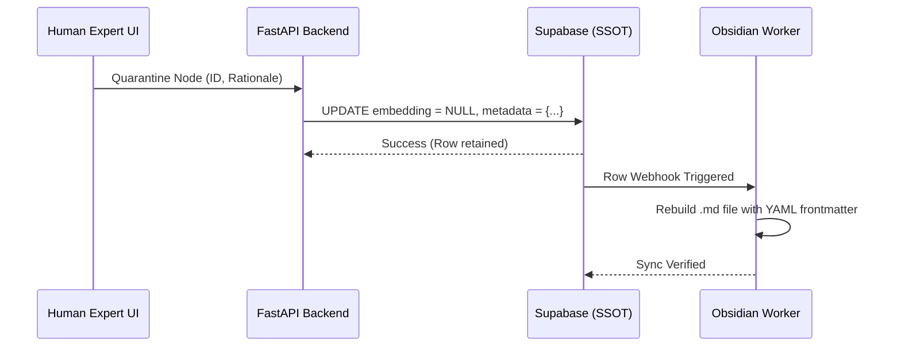

# Digital Twin Framework: Enterprise Implementation & Onboarding Guide

**Role Context:** Senior Architect & Engineering Lead (20+ Years Mangos/Architecture Experience)
**Audience:** New Engineers, Architects, and Implementation Specialists joining the Digital Twin project.
**Classification:** Internal — Implementation Strategy & Risk Mitigation
**Path:** `docs/employee_onboarding_guide.md`

---

## 1. Executive Introduction: The "Jarvis" Paradigm

Welcome to the Digital Twin framework. As a new implementation engineer, you must first unlearn conventional chatbot paradigms. You are not building a simple RAG (Retrieval-Augmented Generation) pipeline, nor are you building a generic conversational AI. 

You are building an **Autonomous Expert Proxy**. 

This system is a strictly bounded, highly deterministic, Python-orchestrated state machine designed to emulate not only *what* an expert knows, but *how they think, speak, and execute tasks*. It operates under the "Jarvis" paradigm:
1. **Routine Absorption:** Handles all repetitive queries and workflow actions autonomously.
2. **Radical Transparency:** Logs every atomic step in a cryptographic ledger.
3. **Instant Self-Suspension:** Suspends operation and hands over to a human expert the microsecond it detects an anomaly or an out-of-bounds scenario.

This guide provides a comprehensive roadmap for approaching the implementation, setting up your environment, understanding the architecture, and navigating the profound "gotchas" and edge cases you will encounter.

---

## 2. Architectural Blueprint & Mental Model

Before writing a single line of code, you must internalize the Global Architecture Topology. The system is distributed across four distinct planes, synchronized via strict unidirectional data flows.

### 2.1 The Four Planes of Execution

1. **The Visual Control Plane (Frontend):** A React Flow and Zustand-powered Glassmorphism dashboard where the human expert configures the twin's cognitive pathways. It uses optimistic UI rendering.
2. **The Intelligence & Orchestration Layer (Backend):** A pure Python layer using FastAPI and LangGraph. Node.js is strictly banned here. This handles bimodal routing, intent classification via SentenceTransformers, and the 4-node LangGraph execution thread.
3. **The Knowledge Graph Command Center (SSOT):** A Supabase (PostgreSQL) adjacency matrix using `pgvector` for HNSW vector search.
4. **The File Projection Plane (Audit Layer):** An Obsidian Vault that mirrors the database into physical `.md` files for compliance, triggered by Supabase row webhooks.

### 2.2 System Architecture Diagram

```mermaid
graph TD
    User([End User / Client]) -->|Inbound Payload| API[FastAPI Gateway]
    API --> Router{Bimodal Intent Router}
    
    %% Smooth Read Path
    Router -->|INFORMATIONAL| PG[pgvector Semantic Search]
    PG --> SSOT[(Supabase SSOT)]
    PG --> Resp[Vetted Response]
    
    %% Active Action Path
    Router -->|ACTIONABLE| LG[LangGraph Execution Core]
    
    subgraph LangGraph State Machine
        LG_N1[Node 1: Data Gathering] --> LG_N2[Node 2: Processing & Evaluation]
        LG_N2 -->|Anomaly Detected| LG_N3[Node 3: Human Intercept HITL]
        LG_N2 -->|Standard| LG_N4[Node 4: Action / Skills Dispatcher]
    end
    
    LG --> LangGraph State Machine
    LG_N3 -.->|Thread Frozen| Expert([Human Expert Override])
    LG_N4 -->|Webhook Trigger| N8N[n8n Orchestration]
    
    SSOT -->|DB Webhooks| Sync[Python Sync Worker]
    Sync -->|File I/O| Obs[Obsidian Vault Audit Ledger]
    
    Expert -->|React Flow UI| SSOT
```

---

## 3. Step-by-Step Implementation Approach

A successful implementation of this platform requires a phased approach. Attempting to build all layers simultaneously will result in race conditions, state synchronization failures, and corrupted vector indexes.

### Phase 1: Storage & Knowledge Graph Foundation
1. **Provision Supabase & PostgreSQL:** Initialize your Supabase instance and enable the `pgvector` extension.
2. **Schema Instantiation:** Create the `knowledge_nodes` and `knowledge_edges` tables. Ensure the `vector(1536)` column is properly indexed using HNSW (`vector_cosine_ops`).
3. **Hierarchy Constraints:** Implement database triggers (`trg_validate_node_hierarchy`) to prevent circular dependencies in the knowledge graph. This is critical; a circular dependency will cause an infinite loop in the CTEs.
4. **Test Vector Retrieval:** Write raw SQL queries using cosine similarity (`<=>`) to ensure your indexing works before connecting the Python backend.

### Phase 2: The Python Intelligence Layer
1. **Bimodal Router Setup:** Implement the FastAPI entry point. Integrate `SentenceTransformers` to convert incoming text to vectors, and establish the 0.85 cosine similarity threshold to distinguish between INFORMATIONAL and ACTIONABLE intents.
2. **LangGraph State Machine Initialization:** Define your `TypedDict` state schema (`session_id`, `user_input`, `extracted_variables`, etc.).
3. **Develop the 4 Nodes:**
   - *Node 1 (Data Gathering):* Must handle multi-turn loops.
   - *Node 2 (Processing):* Must cross-reference against Supabase vectors.
   - *Node 3 (Human Intercept):* Must utilize LangGraph's checkpointer (SQLite/Postgres) to freeze the thread.
   - *Node 4 (Action):* Must execute pure Python function calls to external webhooks, strictly no LLMs.

### Phase 3: The Automation & Audit Fabric
1. **n8n Orchestration:** Set up n8n and configure the deterministic webhooks that Node 4 will call. Map out integrations for Email, Calendar, and CRM.
2. **Obsidian Sync Worker:** Create the Python worker that listens to Supabase Row Webhooks and translates `INSERT` / `UPDATE` operations into physical `.md` files with YAML frontmatter.

### Phase 4: The React Flow Control Plane
1. **Zustand State Store:** Create the client-side state machine. This must be optimistic—updating the UI under 100ms before waiting for the DB commit.
2. **Canvas Rendering:** Implement React Flow to visualize the `knowledge_nodes` and `knowledge_edges`.
3. **The Rollback Mechanism:** Implement the logic where, if the FastAPI backend rejects an edge creation (e.g., due to circular dependency), the UI snaps the node back to its original position.

---

## 4. Critical Issues, Risks, & "Gotchas"

As an engineer on this project, you must proactively defend against several architectural pitfalls. These are not edge cases; they are guaranteed failure modes if ignored.

### 4.1 LangGraph Concurrency & Thread Locking
**The Issue:** If a user sends multiple messages rapidly while Node 2 is processing, the `extracted_variables` dictionary can become corrupted, leading to a hallucinated state.
**The Solution:** You must implement strict thread queueing. The FastAPI gateway must check the `execution_status` of the session. If it is `PROCESSING`, incoming messages must be pushed to a Redis queue or explicitly rejected until the node yields.

### 4.2 The Epistemic Fence & Bimodal Bleed
**The Issue:** The bimodal router might misclassify a prompt injection attack as an INFORMATIONAL query, leading the semantic search to return out-of-context data.
**The Solution:** Implement "Zero-Trust PII Sanitization" before vector embedding. Additionally, enforce absolute thresholding. If the nearest neighbor match is `< 0.85`, the system must gracefully fail over to deflecting the question or triggering Node 3 (Human Intercept). It must never guess.

### 4.3 Database Deadlocks in the Adjacency Matrix
**The Issue:** The React Flow frontend allows users to rapidly drag, drop, and reconnect nodes. Optimistic UI updates can fire dozens of asynchronous `UPDATE` mutations to Supabase, causing row-level deadlocks in PostgreSQL.
**The Solution:** Debounce the UI state commits. Bundle node coordinate updates and edge modifications into a single batch transaction via a dedicated FastAPI endpoint, rather than firing individual RPC calls from the client.

### 4.4 The "Mom and Child" Unlearning Protocol (Vector Tombstoning)
**The Issue:** Enterprise compliance prohibits `DELETE` operations. However, if outdated knowledge remains in the vector index, the twin will continue to retrieve it, leading to fatal clinical or professional errors.
**The Solution:** You must perfectly implement Vector Tombstoning.
1. Capture the expert's `unlearning_rationale`.
2. Execute an `UPDATE` that sets the `embedding` column to `NULL`. This mathematically blinds the HNSW index to the node.
3. Update the `metadata` JSONB column with the rationale and quarantine status.
4. Retain the `node_id` and `parent_id` to preserve the structural audit trail.



### 4.5 Recursive CTE Performance Degradation
**The Issue:** Fetching the entire knowledge graph for the React Flow canvas will crash the browser as the graph scales beyond 5,000 nodes.
**The Solution:** On-Demand Hydration. Write your recursive CTEs (Common Table Expressions) to fetch only the Root nodes and their descendants up to **Depth +2**. Implement dynamic expansion: when the expert clicks a node, fetch the next +2 depth layer on the fly. Index `parent_id` heavily.

---

## 5. Security, Auditing, and Compliance

This system operates in high-liability environments (Healthcare, Legal, Education). Security is not a feature; it is the foundation.

1. **Immutable Execution Traces:** Every state transition in LangGraph must be logged to an `execution_traces` table. If the system books an appointment, the audit log must contain the exact prompt, the matched vector ID, the evaluation score, and the n8n webhook ID.
2. **Row Level Security (RLS):** Supabase must have RLS enabled on all tables. The Python backend authenticates via a Service Role Key, but any client-side queries (if used, though discouraged in favor of the FastAPI gateway) must be strictly scoped to the authenticated user's tenant ID.
3. **Shadow Evaluation Loop:** Build telemetry around Node 3 (Human Intercept). When an expert overrides the twin, the delta between the twin's frozen state and the expert's action must be analyzed asynchronously to detect systemic knowledge gaps.

## 6. Your First 30 Days: Milestones

- **Days 1-7:** Master the Supabase schema, pgvector operations, and the Bimodal Router logic. Write raw SQL queries to retrieve semantic matches.
- **Days 8-15:** Build and test the 4-node LangGraph state machine locally. Simulate multi-turn data gathering without connecting the UI.
- **Days 16-22:** Integrate n8n and the Obsidian Sync Worker. Ensure the "Mom and Child" vector tombstoning works flawlessly.
- **Days 23-30:** Connect the Zustand/React Flow frontend to the FastAPI gateway. Handle state rollbacks and optimistic UI edge cases.

Welcome to the cutting edge of deterministic autonomous systems. Stick to the state machine, trust the DB triggers, and never let the LLM execute actions without a strict Python leash.
