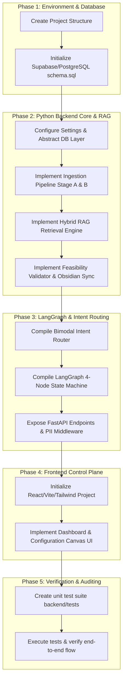

# Implementation Plan - Configuration-Driven Agentic Twin Framework

This plan details the step-by-step SDLC process to build the **Digital Twin (Autonomous Expert Proxy) Framework** from scratch in the `c:\Users\harin\Downloads\doctor\Digital-Twin` workspace.

---

## User Review Required

> [!IMPORTANT]
> **1. Vector Dimension Standardization**
> The documentation mentions both `vector(1536)` (OpenAI embedding dimension) and `SentenceTransformers` (`all-MiniLM-L6-v2`, which is 384 dimensions) for semantic encoding. We propose standardizing the database column to `vector(384)` to enable zero-cost local execution via `all-MiniLM-L6-v2` in our Python backend.
>
> **2. Offline Mocking for Testing**
> The system integrates with external APIs (n8n webhooks, OpenAI embeddings, OCR services). For robust unit testing, we will build mock fallbacks inside the backend code to allow full verification without active API keys or external services.
> 
> **3. Workspace Layout**
> We will create a clean root workspace with:
> - `db/`: Database schemas, functions, and indexes.
> - `backend/`: FastAPI backend, LangGraph state machine, RAG services, and pytest suites.
> - `frontend/`: React + Vite + Tailwind CSS dashboard UI.
> - `obsidian_vault/`: Local folder acting as the Obsidian projection plane.

---

## Open Questions

> [!WARNING]
> **1. Obsidian Sync Strategy**
> Since we do not have a live Obsidian instance running on this environment, should the Sync Worker write markdown files directly to a directory named `obsidian_vault` at the project root? This will allow direct verification using our file viewer.
>
> **2. Supabase Integration**
> Do we want to connect to a live Supabase instance during execution, or should the `DatabaseService` abstraction fall back to a full in-memory dictionary-based mock store for local development and test validation? *Recommended: Implement a toggle to run in mock mode by default when `SUPABASE_URL` is unset, ensuring tests run out-of-the-box.*

---

## SDLC Implementation Roadmap



---

## Proposed Changes

### Component 1: Database Setup & SQL Migrations

#### [NEW] [schema.sql](file:///c:/Users/harin/Downloads/doctor/Digital-Twin/db/schema.sql)
Establish the configuration tables, vector stores, full-text trigram indexes, and session checkpoints.

```sql
-- Enable pgvector and pg_trgm extensions
CREATE EXTENSION IF NOT EXISTS vector;
CREATE EXTENSION IF NOT EXISTS pg_trgm;

-- 1. Expert Twin Configuration Table
CREATE TABLE IF NOT EXISTS expert_twin_configs (
    config_id UUID PRIMARY KEY DEFAULT gen_random_uuid(),
    doctor_id UUID NOT NULL,
    workflow_config JSONB NOT NULL,
    active_version VARCHAR(50) NOT NULL DEFAULT '1.0.0',
    is_feasible BOOLEAN NOT NULL DEFAULT TRUE,
    validation_errors TEXT[] DEFAULT '{}',
    created_at TIMESTAMP WITH TIME ZONE DEFAULT NOW(),
    updated_at TIMESTAMP WITH TIME ZONE DEFAULT NOW()
);

-- 2. Knowledge Chunks Table (Materialized path skeleton tree)
CREATE TABLE IF NOT EXISTS knowledge_chunks (
    chunk_id UUID PRIMARY KEY DEFAULT gen_random_uuid(),
    config_id UUID REFERENCES expert_twin_configs(config_id) ON DELETE CASCADE,
    order_index INT NOT NULL,
    title VARCHAR(255) NOT NULL,
    content TEXT NOT NULL,
    parent_path VARCHAR(500) DEFAULT '', -- materialized path (e.g. 'intake.symptoms')
    tags TEXT[] DEFAULT '{}',
    synthetic_questions TEXT[] DEFAULT '{}',
    embedding vector(384), -- Local SentenceTransformer dimension
    metadata JSONB DEFAULT '{}'::jsonb,
    CONSTRAINT uq_config_order UNIQUE (config_id, order_index)
);

-- 3. Chain of Thought (CoT) Graph Mapping
CREATE TABLE IF NOT EXISTS cot_nodes (
    node_id UUID PRIMARY KEY DEFAULT gen_random_uuid(),
    config_id UUID REFERENCES expert_twin_configs(config_id) ON DELETE CASCADE,
    title VARCHAR(255) NOT NULL,
    node_type VARCHAR(50) NOT NULL, -- 'intake', 'evaluation', 'action'
    content TEXT NOT NULL,
    metadata JSONB DEFAULT '{}'::jsonb
);

CREATE TABLE IF NOT EXISTS cot_edges (
    edge_id UUID PRIMARY KEY DEFAULT gen_random_uuid(),
    config_id UUID REFERENCES expert_twin_configs(config_id) ON DELETE CASCADE,
    source_node_id UUID REFERENCES cot_nodes(node_id) ON DELETE CASCADE,
    target_node_id UUID REFERENCES cot_nodes(node_id) ON DELETE CASCADE,
    relationship_type VARCHAR(50) NOT NULL, -- 'requires', 'contradicts', 'related_to'
    UNIQUE(source_node_id, target_node_id)
);

-- 4. Active Sessions State Checkpointer
CREATE TABLE IF NOT EXISTS active_sessions (
    session_id UUID PRIMARY KEY DEFAULT gen_random_uuid(),
    conversation_id UUID NOT NULL,
    config_id UUID REFERENCES expert_twin_configs(config_id),
    current_node VARCHAR(100) NOT NULL DEFAULT 'start',
    graph_state JSONB NOT NULL DEFAULT '{}'::jsonb,
    is_paused BOOLEAN NOT NULL DEFAULT FALSE,
    requires_review BOOLEAN NOT NULL DEFAULT FALSE,
    created_at TIMESTAMP WITH TIME ZONE DEFAULT NOW(),
    updated_at TIMESTAMP WITH TIME ZONE DEFAULT NOW()
);

-- 5. Execution Telemetry Ledger
CREATE TABLE IF NOT EXISTS execution_traces (
    trace_id UUID PRIMARY KEY DEFAULT gen_random_uuid(),
    session_id UUID REFERENCES active_sessions(session_id) ON DELETE CASCADE,
    step_name VARCHAR(100) NOT NULL,
    prompt_used TEXT NOT NULL,
    response_generated TEXT NOT NULL,
    retrieved_chunk_ids UUID[] DEFAULT '{}',
    classification_score NUMERIC(5,4),
    timestamp TIMESTAMP WITH TIME ZONE DEFAULT NOW()
);

-- 6. Indexes & Performance Optimization
CREATE INDEX IF NOT EXISTS idx_knowledge_chunks_config ON knowledge_chunks(config_id);
CREATE INDEX IF NOT EXISTS idx_knowledge_chunks_embedding ON knowledge_chunks USING hnsw (embedding vector_cosine_ops);
CREATE INDEX IF NOT EXISTS idx_knowledge_chunks_content_trgm ON knowledge_chunks USING gin (content gin_trgm_ops);
CREATE INDEX IF NOT EXISTS idx_active_sessions_conv ON active_sessions(conversation_id);

-- 7. Trigram Lexical Search Matching Function
CREATE OR REPLACE FUNCTION match_knowledge_chunks_lexical(
    query_text TEXT,
    match_threshold FLOAT,
    match_limit INT
)
RETURNS TABLE (
    chunk_id UUID,
    config_id UUID,
    order_index INT,
    title VARCHAR,
    content TEXT,
    parent_path VARCHAR,
    tags TEXT[],
    synthetic_questions TEXT[],
    lexical_score FLOAT
) AS $$
BEGIN
    RETURN QUERY
    SELECT 
        kc.chunk_id,
        kc.config_id,
        kc.order_index,
        kc.title,
        kc.content,
        kc.parent_path,
        kc.tags,
        kc.synthetic_questions,
        similarity(kc.content, query_text)::FLOAT AS lexical_score
    FROM knowledge_chunks kc
    WHERE similarity(kc.content, query_text) > match_threshold
    ORDER BY lexical_score DESC
    LIMIT match_limit;
END;
$$ LANGUAGE plpgsql;
```

---

### Component 2: Backend Core Services

#### [NEW] [config.py](file:///c:/Users/harin/Downloads/doctor/Digital-Twin/backend/app/core/config.py)
Manage app configurations and environment settings.

#### [NEW] [database.py](file:///c:/Users/harin/Downloads/doctor/Digital-Twin/backend/app/core/database.py)
Provide abstract database layer `DatabaseService` and concrete `SupabaseDatabaseService` implementing basic operations and falling back to memory/mock dictionary structures if Supabase credentials are not provided.

#### [NEW] [middleware.py](file:///c:/Users/harin/Downloads/doctor/Digital-Twin/backend/app/core/middleware.py)
Provide a Starlette middleware for zero-trust PII sanitization (emails, phone numbers, SSNs replaced with hash tokens before sending queries to downstream logic, and rehydrated back on return).

#### [NEW] [embedding_service.py](file:///c:/Users/harin/Downloads/doctor/Digital-Twin/backend/app/services/embedding_service.py)
Generate SentenceTransformer embeddings (`all-MiniLM-L6-v2`) locally, returning lists of floats.

---

### Component 3: RAG & Processing Services

#### [NEW] [ingestion_service.py](file:///c:/Users/harin/Downloads/doctor/Digital-Twin/backend/app/services/ingestion_service.py)
- **Stage A (Skeleton Creation)**: Parse Markdown headings into ordered hierarchy layouts, resolve parent paths, normalize titles, and inject virtual parent nodes if gaps exist.
- **Stage B (Intelligence Enrichment)**: Generate synthetic questions, tagging labels, and compile vector embeddings.

#### [NEW] [hybrid_rag_service.py](file:///c:/Users/harin/Downloads/doctor/Digital-Twin/backend/app/services/hybrid_rag_service.py)
Coordinating:
- **Vector search** (similarity threshold `pgvector`) and **Lexical search** (trigram matching) in parallel lanes.
- **Score Fusion**: Normalizing scores and calculating: $Combined = 0.7 \times Vector + 0.3 \times Lexical$.
- **0.85 Hard Gate**: Bypassing and rejecting contexts below `0.85`.
- **Recursive Parent Hydration & Deduplication**: Loading full parent documents from database based on matched child materialized paths, ensuring no duplicate sections.

#### [NEW] [feasibility_validator.py](file:///c:/Users/harin/Downloads/doctor/Digital-Twin/backend/app/services/feasibility_validator.py)
Ensure that dynamic user configurations do not violate sequence rules (e.g. checking that execution nodes have their dependent inputs satisfied, and verifying no cyclic dependencies exist).

#### [NEW] [obsidian_service.py](file:///c:/Users/harin/Downloads/doctor/Digital-Twin/backend/app/services/obsidian_service.py)
Export DB states to physical markdown documents under `obsidian_vault/` using row webhooks/handlers, injecting Chain of Thought and unlearning rationales into YAML frontmatter.

#### [NEW] [journalist_service.py](file:///c:/Users/harin/Downloads/doctor/Digital-Twin/backend/app/services/journalist_service.py)
AI Journalist onboarding agent that scores interview transcripts on a knowledge saturation loop, requesting more context until saturation exceeds $0.90$.

---

### Component 4: State Machine & API Presentation

#### [NEW] [state_machine.py](file:///c:/Users/harin/Downloads/doctor/Digital-Twin/backend/app/orchestrator/state_machine.py)
- Compile a 4-node LangGraph execution thread: `data_gathering`, `processing`, `human_intercept`, and `action_dispatch`.
- Implement active thread isolation locking and checkpointer status persistence.
- Implement the safety escalation boundary override.

#### [NEW] [endpoints.py](file:///c:/Users/harin/Downloads/doctor/Digital-Twin/backend/app/api/endpoints.py)
Setup FastAPI REST routes for config validation, saving configurations, onboarding interviews, document ingestion, query runs, version rollbacks, and audit telemetry.

#### [NEW] [main.py](file:///c:/Users/harin/Downloads/doctor/Digital-Twin/backend/app/main.py)
Assemble the FastAPI app, register routes, and mount PII sanitization middleware.

---

### Component 5: Frontend Control Plane

#### [NEW] [frontend/](file:///c:/Users/harin/Downloads/doctor/Digital-Twin/frontend)
We will initialize a React + Vite application. We'll use vanilla CSS/Tailwind CSS components to construct a premium Glassmorphism Expert twin configurator dashboard, housing three primary modules:
1. **Workflow Configurator Builder**: Canvas showing sequential nodes, toggling auto-pilot, and validating feasibility.
2. **AI Onboarding Journalist Wizard**: A conversational interface letting users run onboarding interviews, detailing transcript entries, saturation scores, and next onboarding questions.
3. **Document Ingestion Hub**: Drag-and-drop workspace supporting markdown inputs, running the parser pipeline, and previewing extracted chunks, paths, tags, and synthetic queries.

---

### Component 6: Pytest Validation Suite

#### [NEW] [backend/tests/](file:///c:/Users/harin/Downloads/doctor/Digital-Twin/backend/tests)
- `test_feasibility_validator.py`: Verify cycle detection and ordering constraints.
- `test_pii_middleware.py`: Check SSN, email, and phone number sanitization and rehydration.
- `test_safety_overrides.py`: Verify that severe payloads halt auto-pilot, freeze the LangGraph state machine, and trigger human intercepts.
- `test_ingestion_pipeline.py`: Verify markdown parser node splits, parent-path bindings, and metadata enrichment.
- `test_hybrid_rag.py`: Validate lane-search fusion scoring, the 0.85 threshold hard-gate, recursive parent block hydration, and deduplication.

---

## Verification Plan

### Automated Tests
1. **Run Pytest Suite**:
   ```bash
   python -m pytest backend/tests -v
   ```
2. **Linter Check**: Run standard formatting and type validations on python files.

### Manual Verification
1. **Document Ingestion Test**: Ingest a sample markdown clinical file, verify chunk generation and correct parent materialized path extraction.
2. **Feasibility Gate Test**: Input a configuration that violates ordering (e.g. evaluating clinical indicators before running intake) and verify the validator flags errors and prevents saving.
3. **Obsidian Output Test**: Verify that saving a config or ingesting chunks outputs `.md` files to `obsidian_vault/` containing correct YAML headers.
4. **Safety Halt Test**: Send a critical symptom query (e.g., "Chest tightness and radiating arm pain") in active execution mode, confirming LangGraph triggers the `Human Intercept` state and writes review flags to DB.
