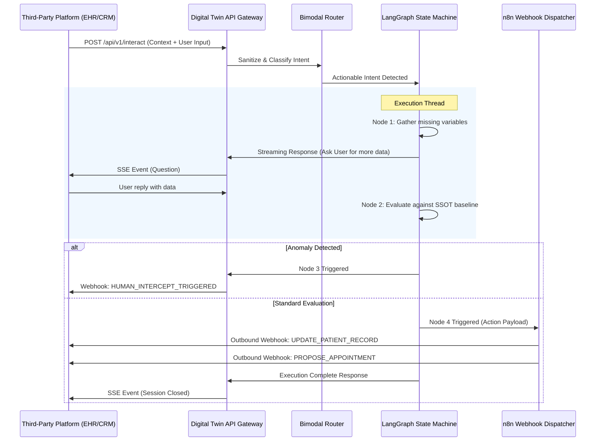

# Digital Twin Integration & Interoperability Specification

**Classification:** Enterprise Public / Partner Integration  
**Architecture Domain:** Headless Proxy & API Gateway  
**Path:** `docs/platform_integration_formats.md`

---

## 1. Executive Overview: The Headless Proxy

The Digital Twin framework is fundamentally designed as a **headless, API-first cognitive proxy**. While it ships with a native React-based visual control plane and an Obsidian-backed audit vault, its core intelligence engine is entirely decoupled from any specific presentation layer. 

Any external platform—whether it is an Electronic Health Record (EHR) system, a Learning Management System (LMS), a corporate CRM (like Salesforce), a native mobile application, or a voice-telephony gateway (e.g., Twilio)—can seamlessly integrate with the Twin.

This document defines the strict API contracts, data formats, webhook specifications, and security protocols required to interface with the Digital Twin's FastAPI gateway and n8n orchestration layer.

---

## 2. Inbound Interaction Interface (The Bimodal Router)

All incoming queries, chat messages, and command executions must pass through the Bimodal Intent Router. This endpoint evaluates the payload, sanitizes it, and dynamically routes it to either the `pgvector` semantic search (Smooth Read Path) or the LangGraph state machine (Active Action Path).

### 2.1 The Standard Interaction Payload

**Endpoint:** `POST /api/v1/interact`
**Content-Type:** `application/json`

The inbound request must follow a strict schema. The proxy expects not only the user's utterance but also any environmental context the host platform can provide.

```json
{
  "session_id": "a1b2c3d4-e5f6-7890-1234-56789abcdef0", // Optional: If omitted, the proxy starts a new thread.
  "tenant_id": "org_778899aabbcc", // Required for multi-tenant isolation.
  "user_input": {
    "text": "I've been having severe headaches since yesterday morning.",
    "attachments": [
      {
        "type": "image/jpeg",
        "url": "https://host-platform.com/secure-storage/mri_scan_01.jpg"
      }
    ]
  },
  "context": {
    "user_id": "usr_9988776655",
    "platform": "EHR_EPIC_V12",
    "prior_variables": {
      "age": 45,
      "pre_existing_conditions": ["hypertension"]
    }
  }
}
```

### 2.2 Synchronous Response vs. Asynchronous Streaming

Because LangGraph executions (Actionable paths) may require multi-turn data gathering or complex evaluations against the SSOT, the proxy supports both synchronous JSON responses and Server-Sent Events (SSE) for real-time streaming.

**Streaming Request:** Add the header `Accept: text/event-stream`.

**Stream Output Format:**
```text
data: {"event": "status_update", "status": "GATHERING", "message": "Evaluating symptom baseline..."}
data: {"event": "node_transition", "from": "Node 1", "to": "Node 2"}
data: {"event": "final_response", "route": "graph_execution", "data": {"response": "Based on the protocol, I need to know if the headache is accompanied by visual disturbances."}}
```

---

## 3. Outbound Execution Specifications (n8n Skills Dispatch)

The Digital Twin does not execute API calls to external platforms directly. Instead, Node 4 (Action / Skills Dispatcher) of the LangGraph state machine constructs a standardized JSON payload and fires it to an **n8n Webhook**. The external platform must either listen for these webhooks directly or allow n8n to act as the middleware adapter.

### 3.1 Data Muting & Synchronization Webhooks (CRM/EHR Updates)

When the Twin successfully gathers variables and evaluates them against the expert's baseline, it can push structured data back to the host platform.

**Outbound Payload Structure:**
```json
{
  "event_type": "STATE_MUTATION",
  "source_thread": "a1b2c3d4-e5f6-7890-1234-56789abcdef0",
  "target_platform_id": "EHR_EPIC_V12",
  "action": "UPDATE_PATIENT_RECORD",
  "payload": {
    "patient_id": "usr_9988776655",
    "extracted_clinical_variables": {
      "primary_symptom": "severe headache",
      "onset": "24 hours",
      "associated_symptoms": ["none"],
      "severity_score": 8
    },
    "twin_evaluation": {
      "matched_protocol_node": "550e8400-e29b-41d4-a716-446655440000",
      "risk_classification": "ELEVATED",
      "recommended_action": "PRIORITY_CONSULT"
    }
  },
  "cryptographic_hash": "sha256_...signature..."
}
```

### 3.2 Appointment & Calendar Booking

If the Twin determines an intervention is necessary, it will dispatch a scheduling request. External calendar systems must ingest this format.

**Outbound Payload Structure:**
```json
{
  "event_type": "CALENDAR_DISPATCH",
  "action": "PROPOSE_APPOINTMENT",
  "payload": {
    "participant_id": "usr_9988776655",
    "expert_id": "dr_smith_01",
    "duration_minutes": 30,
    "urgency": "HIGH",
    "context_summary": "Elevated headache risk requiring manual review.",
    "preferred_windows": [
      {"start": "2026-06-12T09:00:00Z", "end": "2026-06-12T12:00:00Z"}
    ]
  }
}
```

---

## 4. The Human Intercept (HITL) Webhook

A core pillar of the framework is its ability to instantly suspend operations and hand off to a human. When Node 3 (Human Intercept) is triggered, the proxy fires a critical webhook to the host platform's dashboard, alerting the human expert.

### HITL Alert Format

```json
{
  "event_type": "HUMAN_INTERCEPT_TRIGGERED",
  "severity": "CRITICAL",
  "session_id": "a1b2c3d4-e5f6-7890-1234-56789abcdef0",
  "trigger_reason": "ANOMALY_DETECTED",
  "details": {
    "rule_violated": "Blood pressure exceeds standard protocol bounds.",
    "current_state": "Thread Frozen at Node 3",
    "resume_url": "https://twin.controlplane.internal/resolve/a1b2c3d4..."
  },
  "context_dump": {
    "variables_gathered_so_far": {...},
    "last_user_message": "My blood pressure is 180/120."
  }
}
```
*Host Integration Requirement:* The integrating platform must immediately halt any automated responses on its end and route the `resume_url` or context to the human expert's active screen.

---

## 5. Knowledge Graph Ingestion API

Platforms can automatically push structural knowledge, training documents, or updated standard operating procedures (SOPs) directly into the Digital Twin's Supabase SSOT via the Ingestion Pipeline.

### 5.1 Document Ingestion via API

**Endpoint:** `POST /api/v1/ingest/document`
**Content-Type:** `multipart/form-data`

This endpoint accepts PDF, Markdown, or docx files. The backend orchestrates the OCR, structural markdown parsing, vector embedding generation via SentenceTransformers, and injection into the `knowledge_nodes` table.

### 5.2 Direct Node Injection (JSON)

For platforms with highly structured data (like an LMS with distinct modules), direct JSON injection is preferred.

**Endpoint:** `POST /api/v1/ingest/nodes`
**Content-Type:** `application/json`

```json
{
  "tenant_id": "org_778899aabbcc",
  "nodes": [
    {
      "parent_id": "root_node_123",
      "content": "Protocol X: If condition Y is met, execute Z.",
      "relationship_type": "requires",
      "metadata": {
        "source_system": "LMS_V2",
        "author": "Dr. Jane Doe"
      }
    }
  ]
}
```
*Note:* The backend automatically generates the 1536-dimensional vector embedding for the `content` string before committing to PostgreSQL.

---

## 6. Integration Architecture Diagram

The following sequence diagram illustrates the lifecycle of a third-party platform interacting with the Digital Twin via the API Gateway.



---

## 7. Security, Auth, & Rate Limiting

### 7.1 Authentication (JWT & Service Keys)
All integrations must authenticate using either a short-lived JSON Web Token (JWT) signed by a trusted Identity Provider (IdP), or a static Service Role Key passed via the `Authorization: Bearer <token>` header.

### 7.2 Zero-Trust PII Sanitization
The integrating platform is responsible for basic data sanitization. However, the Digital Twin API Gateway enforces a mandatory Zero-Trust pipeline. Before any text is passed to the embedding model or the state machine, an internal Named Entity Recognition (NER) pipeline strips Social Security Numbers, exact dates of birth, and financial data, replacing them with generic tokens (e.g., `<DATE_OF_BIRTH>`, `<CREDIT_CARD>`).

### 7.3 Epistemic Fencing Configuration
During integration onboarding, the host platform must define the Epistemic Fence parameters:
1. **Cosine Similarity Threshold:** Defaults to 0.85. Can be tightened to 0.90 for high-risk environments.
2. **Fallback Behavior:** Define whether the system should return a generic deflection ("I am not authorized to answer this") or immediately trigger the HITL webhook when a query falls outside the knowledge graph.

## 8. Summary Checklist for Integration Partners
- [ ] Ensure ability to consume and parse SSE (Server-Sent Events) for multi-turn dialogues.
- [ ] Set up dedicated REST endpoints to receive n8n Action Dispatches (CRM updates, Scheduling).
- [ ] Set up a high-priority listener for the `HUMAN_INTERCEPT_TRIGGERED` webhook.
- [ ] Provide initial structural knowledge base exports via the Ingestion API to populate the SSOT.
- [ ] Configure JWT authentication with the correct `tenant_id` claims.
