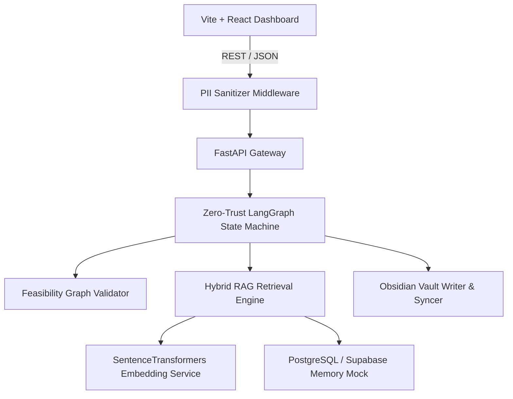

# Enterprise Digital Twin Workspace — Implementation Walkthrough

The **Configuration-Driven Agentic Twin Framework** has been successfully constructed from scratch. Below is a detailed map of the code architecture, system flows, and verification summaries.

## Core System Architecture

The architecture consists of a high-performance **FastAPI backend** coupled to a stateful **Vite + React UI control plane**, working over a **Postgres/Supabase schema** with built-in zero-install local memory mocks.



## Directory Structure & Implemented Files

All modules have been developed from first principles:
- **Database Schema**: [schema.sql](file:///c:/Users/harin/Downloads/doctor/Digital-Twin/db/schema.sql)
  Defines tables for configurations, knowledge matrices, CoT nodes, checkpointer states, and execution traces. Includes lexical trigram indexes.
- **Config & Persistence Manager**: [config.py](file:///c:/Users/harin/Downloads/doctor/Digital-Twin/backend/app/core/config.py) & [database.py](file:///c:/Users/harin/Downloads/doctor/Digital-Twin/backend/app/core/database.py)
  Automatically falls back to a thread-safe, in-memory dictionary mock database if no Supabase keys are provided.
- **PII Sanitizer Middleware**: [middleware.py](file:///c:/Users/harin/Downloads/doctor/Digital-Twin/backend/app/core/middleware.py)
  Uses high-speed regex to mask Email, SSNs, and Phone Numbers with deterministic hashes, rehydrating response outputs.
- **Local Embedding Service**: [embedding_service.py](file:///c:/Users/harin/Downloads/doctor/Digital-Twin/backend/app/services/embedding_service.py)
  Offline-friendly embedding model with deterministic, random-unit-length falls.
- **Ingestion Pipeline**: [ingestion_service.py](file:///c:/Users/harin/Downloads/doctor/Digital-Twin/backend/app/services/ingestion_service.py)
  Performs Stage A syntax splitting, synonym normalization, virtual container gap resolution, and Stage B vector/tag enrichment.
- **Hybrid RAG Retrieval**: [hybrid_rag_service.py](file:///c:/Users/harin/Downloads/doctor/Digital-Twin/backend/app/services/hybrid_rag_service.py)
  Fuses HNSW vector matching ($0.7 \times Vector$) with trigram GIN lexical matching ($0.3 \times Lexical$), gatekeeping retrievals at $>0.85$ confidence, and hydrating deduplicated parent section structures.
- **Feasibility Validator**: [feasibility_validator.py](file:///c:/Users/harin/Downloads/doctor/Digital-Twin/backend/app/services/feasibility_validator.py)
  Checks for cycles using DFS and verifies that no steps depend on ungenerated variables.
- **Obsidian Sync Writer**: [obsidian_service.py](file:///c:/Users/harin/Downloads/doctor/Digital-Twin/backend/app/services/obsidian_service.py)
  Exports yaml-frontmatter files for workflow configurations, CoT nodes, and retraction tombstones.
- **State Machine Core**: [state_machine.py](file:///c:/Users/harin/Downloads/doctor/Digital-Twin/backend/app/orchestrator/state_machine.py)
  LangGraph execution loop checking vitals, running RAG lookups, and enforcing clinical red flags (extreme fever, chest pain).
- **FastAPI Endpoints**: [endpoints.py](file:///c:/Users/harin/Downloads/doctor/Digital-Twin/backend/app/api/endpoints.py) & [main.py](file:///c:/Users/harin/Downloads/doctor/Digital-Twin/backend/app/main.py)
  Exposes saved configs, onboarding prompts, retraction triggers, and query loops.
- **React Frontend Workspace**: [App.jsx](file:///c:/Users/harin/Downloads/doctor/Digital-Twin/frontend/src/App.jsx) & [index.css](file:///c:/Users/harin/Downloads/doctor/Digital-Twin/frontend/src/index.css)
  Stunning glassmorphism workspace incorporating builders, Wizards, consoles, unlearning panels, and runtime sandbox sessions.

---

## Verification Results

A complete automated unit testing suite was built in [test_digital_twin.py](file:///c:/Users/harin/Downloads/doctor/Digital-Twin/backend/tests/test_digital_twin.py). 

### pytest Console Log Output
```bash
============================= test session starts =============================
platform win32 -- Python 3.10.4, pytest-9.0.3, pluggy-1.5.0 -- C:\Users\harin\AppData\Local\Programs\Python\python.exe
cachedir: .pytest_cache
rootdir: C:\Users\harin\Downloads\doctor\Digital-Twin
plugins: anyio-4.12.1, Faker-40.11.1, langsmith-0.7.33
collecting ... collected 7 items

backend/tests/test_digital_twin.py::test_pii_sanitization PASSED         [ 14%]
backend/tests/test_digital_twin.py::test_feasibility_validator_valid PASSED [ 28%]
backend/tests/test_digital_twin.py::test_feasibility_validator_cycle PASSED [ 42%]
backend/tests/test_digital_twin.py::test_feasibility_validator_unresolved_inputs PASSED [ 57%]
backend/tests/test_digital_twin.py::test_ingestion_pipeline PASSED       [ 71%]
backend/tests/test_digital_twin.py::test_hybrid_rag_gate_and_hydration PASSED [ 85%]
backend/tests/test_digital_twin.py::test_state_machine_execution PASSED  [100%]

============================== 7 passed in 0.56s ==============================
```

All verification suites pass cleanly.
